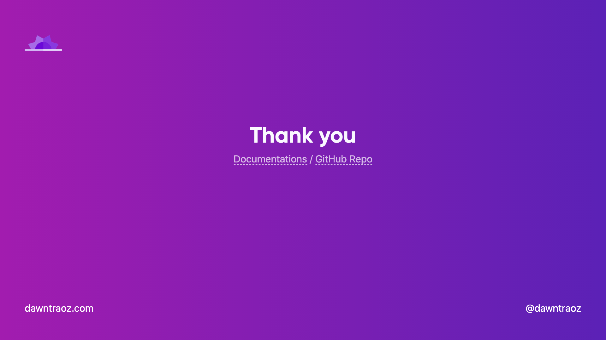
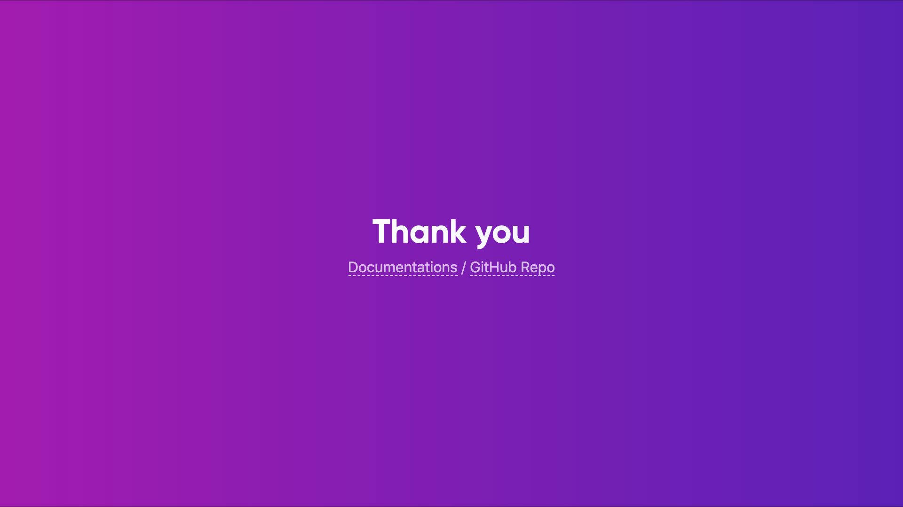
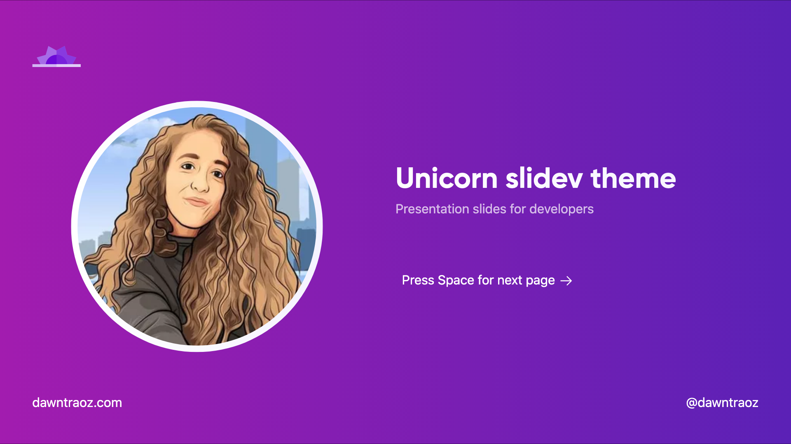
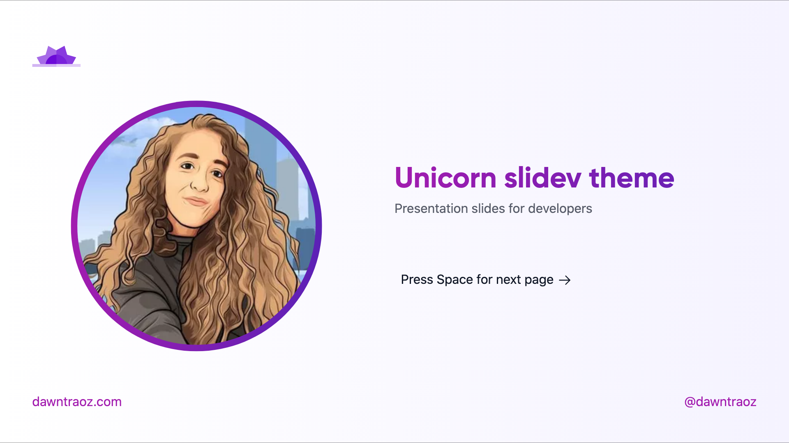
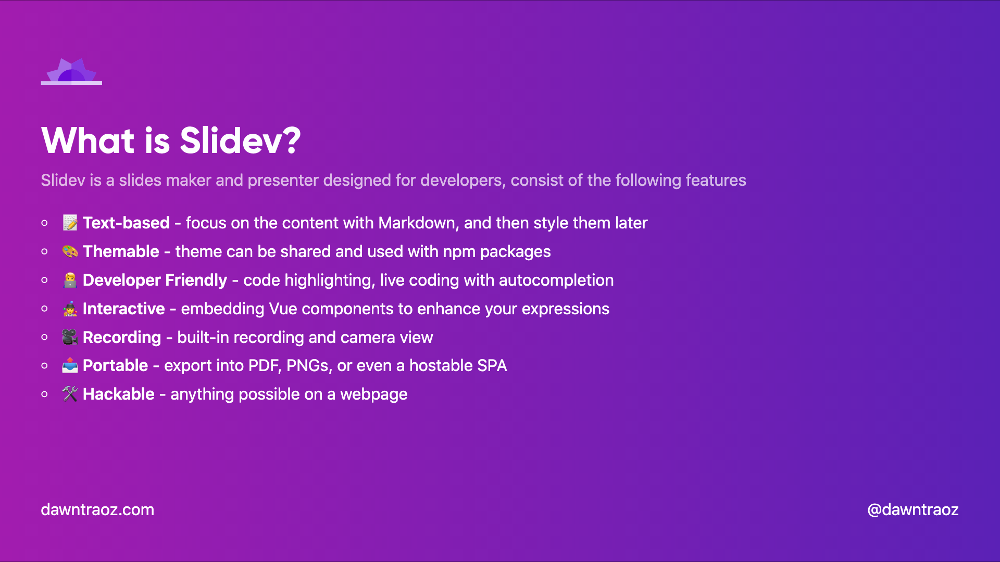
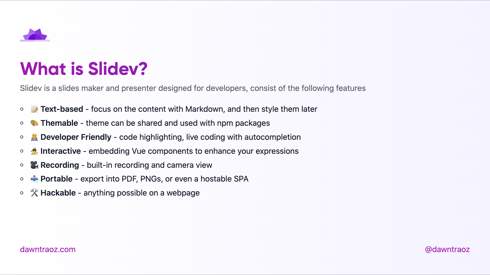
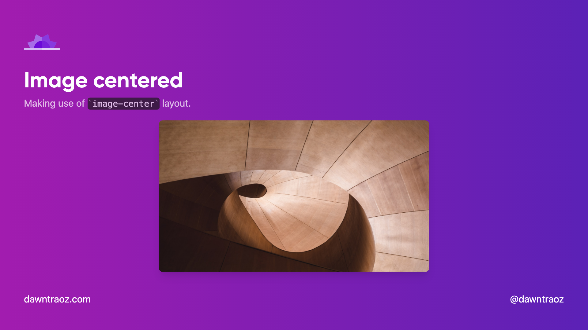
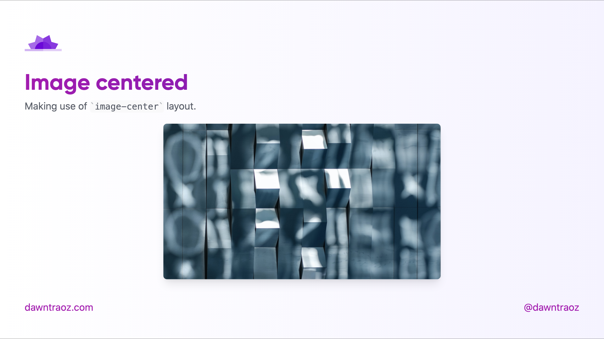
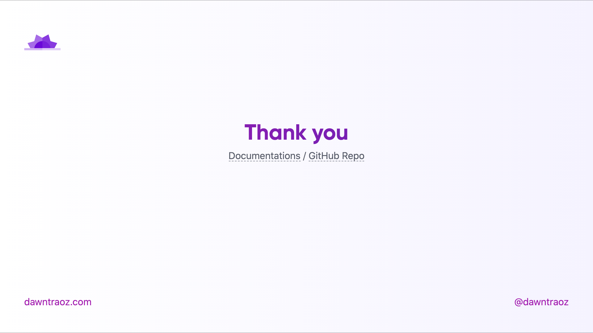

# slidev-theme-unicorn

[](https://www.npmjs.com/package/slidev-theme-unicorn)

A Unicorn theme for [Slidev](https://github.com/slidevjs/slidev).

This theme is based on [dawntraoz.com](https://www.dawntraoz.com/) website design.

Live demo: 

## Install

Add the following frontmatter to your `slides.md`. Start Slidev then it will prompt you to install the theme automatically.

<pre><code>---
theme: <b>unicorn</b>
---</code></pre>

Learn more about [how to use a theme](https://sli.dev/themes/use).

## Layouts

This theme provides the following layouts:

### Common properties

By default any layout will contain a header and a footer expecting:

```
---
logoHeader: 'https://www.dawntraoz.com/images/logo.svg'
website: 'dawntraoz.com'
handle: 'dawntraoz'
---
```

If you don't add this property it will be an empty slide expecting your content:

With properties            | Without properties 
:-------------------------:|:-------------------------:
 | 

### Intro `intro`

Usage:

```
---
layout: intro
introImage: 'https://img2.storyblok.com/312x312/filters:format(webp)/f/79165/400x400/1082ff0d24/dawntraoz-alba-silvente.jpg'
---
```

Dark                       | Light
:-------------------------:|:-------------------------:
 | 

---


### Default `cover`

Usage:

```
---
layout: cover
---
```

Dark                       | Light
:-------------------------:|:-------------------------:
 | 

---

### Image Centered `image-center`

The content will be place before the image, you can add a title, subtitle to give context to the image.

```
---
layout: image-center
image: 'https://source.unsplash.com/collection/94734566/1920x1080'
imageWidth: '450'
imageHeight: '950'
---
```

Dark                       | Light
:-------------------------:|:-------------------------:
 | 

---

### Text centered `center`

```
---
layout: center
---
```

Dark                       | Light
:-------------------------:|:-------------------------:
 | 

---

## Components

>  WIP

## Contributing

- `npm install`
- `npm run dev` to start theme preview of `example.md`
- Edit the `example.md` and style to see the changes
- `npm run export` to generate the preview PDF
- `npm run screenshot` to genrate the preview PNG
